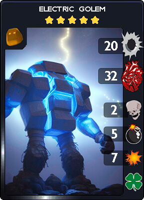
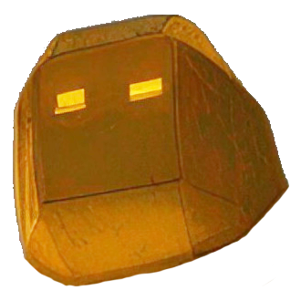
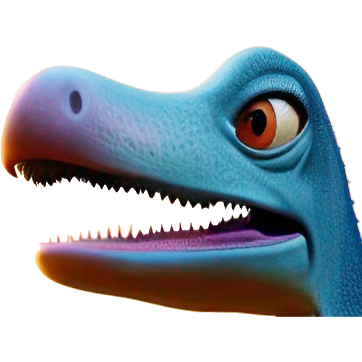
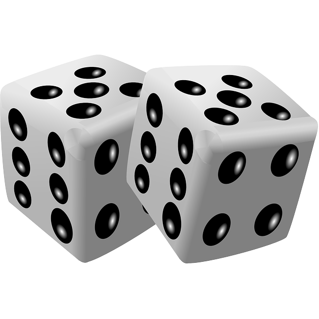
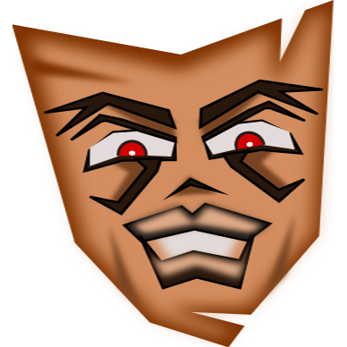
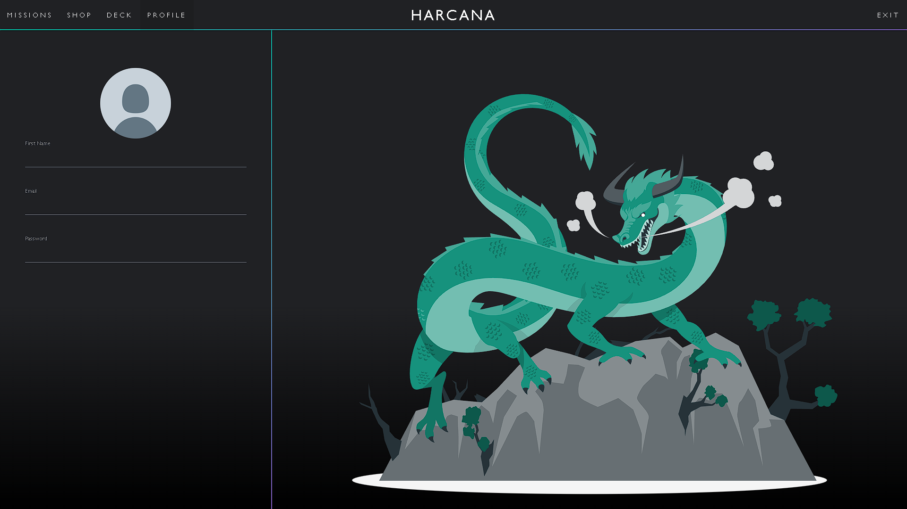
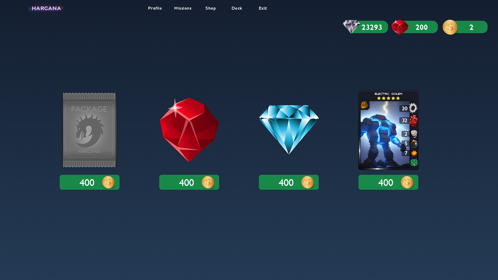
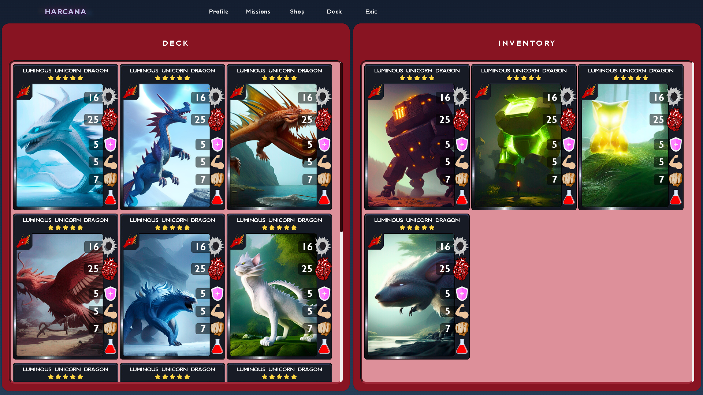

## HARCANA: The Card Game

Jogo de cartas com objetivo de colecionar cartas e vencer desafios. Cada missão cumprida habilita um novo desafio e concede moedas que podem ser gasto na loja para comprar pacotes de cartas e jóias para aumentar o número de estrelas das cartas e deixá-las mais fortes.

## Regras

- Cada jogador começa com 4 cartas na mão.
- Todo início de turno o jogador puxa 1 carta de modo a ficar sempre com 4.
- Uma carta é jogada por turno.
- Ao entrar em campo suas habilidades são ativadas.
- Em seguida, é passado automaticamente para a fase e batalha.
- Na fase de batalha todas as cartas do jogador, uma por vez, atacam, caso exista, a carta a frente ou o personagem do adversário no caso campo a frente livre.
- O jogador vence ao zerar a saúde do personagem do adversário.

## Carta

Cartas tem nome, estrelas, tipo, dano, saúde, de 0 a 3 habilidades e 0 ou 1 especial.

## Tipos
Os tipos de carta atualmente no jogo são:
-  **Dragão**: Inclui Wyvern, Amphiptere, Wrym, Lindwrum, Drake entre outros.
-  **Golem**: Inclui monstros de pedra e similares.
-  **Elfo**: Inclui duendes entre outros.
-  **Animal**: Inclui insetos e não inclui aves.
-  **Pássaro**: Inclui todos os animais que tem pena.
-  **Dinossauro**: Inclui animais pré-históricos.
-  **Máquina**: Inclui droids, cyborgs entre outros.
-  **Alienígena**: Inclui animais de outros planetas.
-  **Orc**: Inclui monstros fora de outras categorias.

## Habilidades

Algumas das habilidades do jogo são:

-  **Cura**: Ao entrar em campo, cartas aliadas adjacentes recebem um incremento de x em sua saúde.
-  **Golpe**: Ao entrar em campo, decrementa em x a saúde do adversário a frente.
-  **Bênção**: Ao entrar em campo, concede um incremento de x de dano e saúde a uma outra carta aliada aleatoriamente.
-  **Maldição**: Ao entrar em campo, decrementa em x a saúde e dano a uma carta adversária aleatoriamente.
-  **Explosão**: Ao entrar em campo, decrementa em x a saúde de todas as cartas em campo.
-  **Aleatório**: Ao entrar em campo, habilidade é trocada por outra aleatoriamente.
-  **Confusão**: Ao atacar, decrementa em x a saúde de outra carta em campo aleatoriamente.
-  **Escudo**: Habilidades de decremento de saúde reduzem o Escudo no lugar. O Escudo é removido a chegar a zero e reduções seguintes voltam a afetar a saúde.
-  **Contra-Ataque**: Ao ser atacado, decrementa a saúde a carta atacante em x.
-  **Brutalidade**: Ao atacar, decrementa a saúde em x das cartas adjacentes a atacada.

## Especiais

Alguns dos especiais do jogo são:

-  **Aproximação**: Ao entrar em campo, se posiciona entra cartas aliadas.
-  **Distanciamento**: Ao entrar em campo, se posiciona a uma casa de distância de cartas aliadas.
-  **Furtividade**: Ao entrar em campo, se posiciona na casa mais a direita.
-  **Paralisia**: Ao entrar em campo, paralisa adversário a frente o impedindo de atacar no próximo turno.
-  **Vidente**: Enquanto em campo, jogador consegue vizualizar cartas da mão do adversário.
-  **Sorte**: Enquanto em campo, aliados adjacentes com Confusão afetam apenas adversários.
-  **Antídoto**: Torna-se imune a Veneno, Hemorragia e Sanguessuga.

## Telas

- **Página Inicial**: Primeira página vizualizada ao abrir o jogo.

- **Tela de Cadastro**: Página para criar uma conta.

- **Tela de Login**: Página para entrar no jogo.

- **Tela de Missões**: Jogador pode escolher uma missão habilitada para fazer e ganhar uma quantidade de moedas como recompensa.

- **Tela de Perfil**: É possível alterar a senhar e outras informações pessoais.

- **Tela de Loja**: Usando moedas, é possível comprar pacotes de cartas, jóias ou uma carta disponível para venda por uma semana.

- **Tela de Inventário**: Onde se edita o baralho e também melhora os atributos das cartas com jóias.

- **Tela de Jogo**: Ao selecionar uma missão o jogador vai direto para Tela de Jogo enfrentar um desafio.

## Autores

- Wadson Pontes - [@WadsonPontes](https://github.com/WadsonPontes)
- Jason Willyan - [@jasonwillyan](https://github.com/jasonwillyan)
- Rodrigo Saads - [@Rsaads](https://github.com/Rsaads)
- Robert Matheus - [@rbert1n](https://github.com/rbert1n)